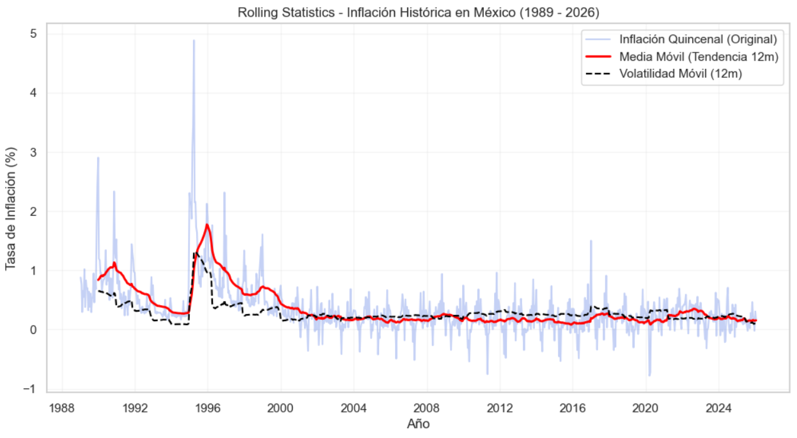
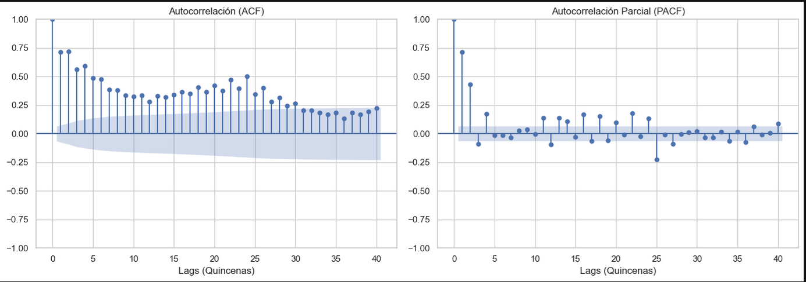
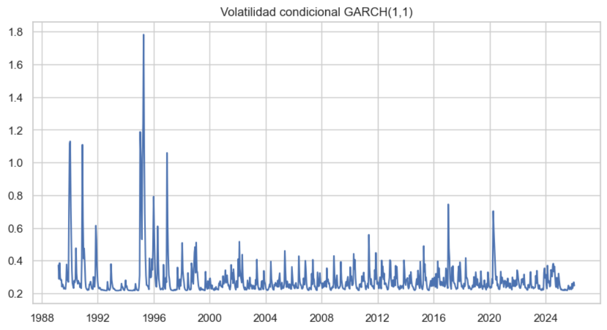

# Análisis Económico de Inflación en México


## 📌 Descripción

Este proyecto implementa un análisis econométrico profundo de la inflación quincenal histórica en :contentReference[oaicite:0]{index=0}, desde 1989 hasta 2026, con el objetivo de:

- Determinar la persistencia de la inflación.
- Evaluar la presencia de volatilidad condicional.
- Medir la velocidad de disipación de choques inflacionarios.
- Aplicar modelos AR y GARCH para describir la dinámica de la inflación.

El análisis fue realizado en Python empleando técnicas de series de tiempo y modelos de volatilidad.

---

## 🎯 Objetivos

- Transformar y limpiar datos inflacionarios oficiales.
- Analizar correlaciones y persistencia temporal.
- Seleccionar y estimar modelos AR óptimos.
- Diagnosticar heterocedasticidad.
- Estimar un modelo AR-GARCH con interpretación económica.
- Calcular el half-life de choques de volatilidad.

---

## 🛠️ Tecnologías y Librerías Utilizadas

- Python 3.x  
- pandas  
- numpy  
- statsmodels  
- arch  
- matplotlib  
- seaborn  
- jupyter notebook

---

## 🧾 Estructura del Repositorio

economic-analysis-mexico/

├── data/

│ ├── raw/

│ └── processed/

├── notebooks/

│ └── 01_inflation_analysis.ipynb

├── src/

├── images/

├── requirements.txt

└── README.md


---

## 📈 Resultados Principales

Algunos de los resultados clave obtenidos son:

✔ La inflación quincenal es estacionaria.  
✔ Una estructura autoregresiva AR(4) captura bien la media de la inflación.  
✔ Hay presencia significativa de heterocedasticidad condicional.  
✔ El modelo AR(4)-GARCH(1,1) captura clustering de volatilidad.  
✔ El half-life de choques de volatilidad es de ≈ 2 quincenas.

---

## 📌 Gráficas Relevantes

  
*Serie completa de inflación quincenal en México (1989–2026).*

  
*Funciones de autocorrelación y autocorrelación parcial.*

  
*Volatilidad condicional estimada con GARCH(1,1).*

---

## 📂 Cómo Ejecutar

1. Clonar el repositorio:
```bash
git clone https://github.com/brenelga/economic-analysis-mexico.git
```

2. Instalar dependencias:
```bash
pip install -r requirements.txt
```

3. Ejecutar el notebook:
```bash
jupyter notebook notebooks/01_inflation_analysis.ipynb
```

## ⭐ Autor
**Jesus Brenel Galicia Aguilar**

TSU en Tecnologías de la Información. Área de Desarrollo de Software Multiplataforma.

**Cedula Profesional:** 15104776

**Linkedin:** https://www.linkedin.com/in/brenelga

**Github:** https://www.github.com/brenelga